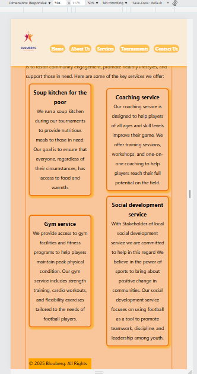
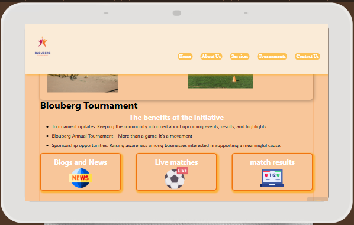

Proposal content 
Our organisation is a non-profit communication organisation that is hosting monthly tournament
The website is created with the aim of raising awareness amongst the youth on the community and also to attract sponsorships from various business interestedin giving back to the community for a good cause

1	Organisation overview 
a.	Organisation name: Blouberg Annual Tournament

b.	History:
a.	Our organisation started this year in Jan 2025 by successfully hosting a tournament then it was agreed by the community leaders that this tournament should be hosted on monthly basis and also  sponsors needs to be sought. 

c.	Mission and Vision
a.	To promote and support local talent 
b.	To take kids out of  streets
c.	entertainment
d.	Target Audience
a.	Community members
b.	Local business people
c.	Community clubs

2	Website Goals and Objectives
a.	Updates regarding the tournament
b.	Brand awareness for sponsoring
c.	Brand awareness for community villages wishing to participate 
3	Current Website Analysis
a.	We currently do not have website

4	Website features and functionality
a.	The website will have a form for companies that wish to participate in sponsoring 
b.	The website will have a form for club that wish to participate in regular Tournament  
c.	News section for any update regarding the tournament.
d.	Various teams news can also have their news covered – Access will be granted for each team to update the website
e.	The website will have about us section to house information regarding the tournament – This is designed to inform our would-be sponsors about the organisation. 
f.	Gallery and live podcasts during the tournament
g.	Live update during tournament 

5	Design and User Experience
a.	The website should be light in size, Easy to use and navigate 
b.	It will have social media link to share
c.	Should be mobile friendly
d.	Should be searchable on google and social media
e.	Colours (#6aa84f) - green
f.	)
g.	Typography: Sans Serif
h.	Wireframes – We going to use Figma - https://www.figma.com/

6	Technical requirements
a.	Domain name: BloubergTournament
b.	Technical requirement (JS, HTML and CSS)

8 Sitemap

7	Timeline and Milestone
a.	Week 1:  Content layout, wireframe and domain registration
b.	Week 2 - 3:  information plotting, wireframe and mockup submission 
c.	Week 4: CSS  
d.	Week 4: JS (functionality)
e.	Week 5: SEO fixes and content submission
f.	Next month week 2: Go Live

8	Budget 
a.	Costs: R 3000
b.	Annual domain registration: R100
c.	Monthly hosting fee  R99 Afrihost

//part 2

//Changes

We change enquiry page from equiry to tournament page since we have multiple tournament to showcase, enquiry froms will be hosted underneath contact us page as 
it contains relevant info and people go to the page to get contact details therefore can also send us quiries via this form

//
added social media from this side: https://www.flaticon.com/free-icons/social-media

navigatioon Menu
we have two set of menu, one set is for desktop >1024px while the other set is for smaller screen <1023
We will then switch between the two menu depending on the device. We planning to use Javascript to use hamburger menu once we implemented Javascript

Logo
will be adjusted to be reponsive as per device
<!-- 
moble screenshot -->
Mobile device optimisations - Tablet and Screenshot

<!-- tablet screenshot -->

laptop and bigger screen

for easy refence i upload mobile optimisation in a folder \Blouberg-Tournament\images\mobileOptimisaScreenshot

Based on the feedback or rubric the following item will be addressed

Some vague comments added but does not explain fully 
-add comments on css for different page
-
-
-

Content is missing or irrelevant. 
- added a new page called tournament
- add more content on service page 
- add images

Budget is vague or unrealistic. 
- Website development cost R3000
- Website maintainance cost R700 per month
 - website hosting fee R100
 -Domain registration R100 per year
 total budget: 3900

 
 [2.2.0] - 2025-10-07
adding AJAX Forms"

 [2.1.0] - 2025-10-06
 working on th gallery slideshow

 [2.1.0] - 2025-10-02
Changed

Reduced image sizes to improve performance and mobile SEO (site reduced from 35MB to 15MB).

Used TinyPNG
 for compression.

Added

Started work on JavaScript form validation.

[2.0.0] - 2025-10-01
Added

robots.txt file to control search engine crawling.

sitemap.xml to list all important URLs and assign priority for SEO.

Changed

General SEO improvements for better indexing.

[1.7.0] - 2025-09-31
Changed

Styled footers for consistency.

Updated styling on the About Us page.

[1.6.1] - 2025-09-30
Added

Illustrative (non-final) images.

Fixed

Footer CSS issues.

[1.6.0] - 2025-09-30
Changed

Navigation menu orientation improved for mobile devices (<600px).

Footer design updates.

[1.5.0] - 2025-09-29
Testing

Cross-browser testing for website compatibility.

[1.4.0] - 2025-09-28
Changed

Adjusted website based on user feedback.

[1.3.0] - 2025-09-25
Changed

Mobile website optimization testing.

[1.2.0] - 2025-09-24
Added

More images across the website.

[1.1.0] - 2025-09-20 → 2025-09-30
Added

Social media icons (to be linked soon).

Changed

Tournament page design and styling.

Adjustments to navigation menu for mobile devices.

[1.0.0] - 2025-09-17
Added

Tournament page created.

[1.2.0]
working on seo

